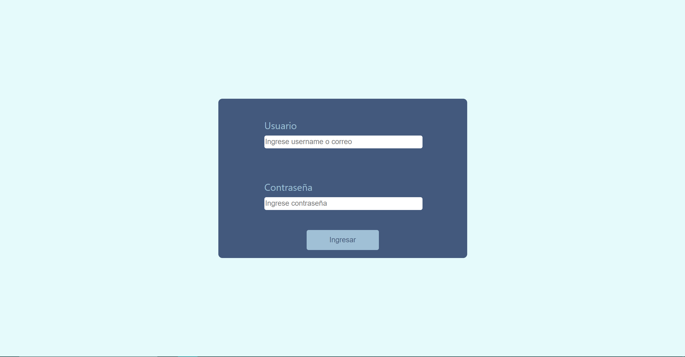

# Social Network App 💅

## Live Demo 🧬
The web app is hosted in GitHub Pages; you can see it 👉 [Here](https://nestornieto.github.io/pw/) 👈.

## Learning Difficulties 💻
* Unstable third-party API integration. 
* Responsive design.
* Token based authorization.
* Adaptative image usage.
* Custom notification.
* Usage of react Hooks.

